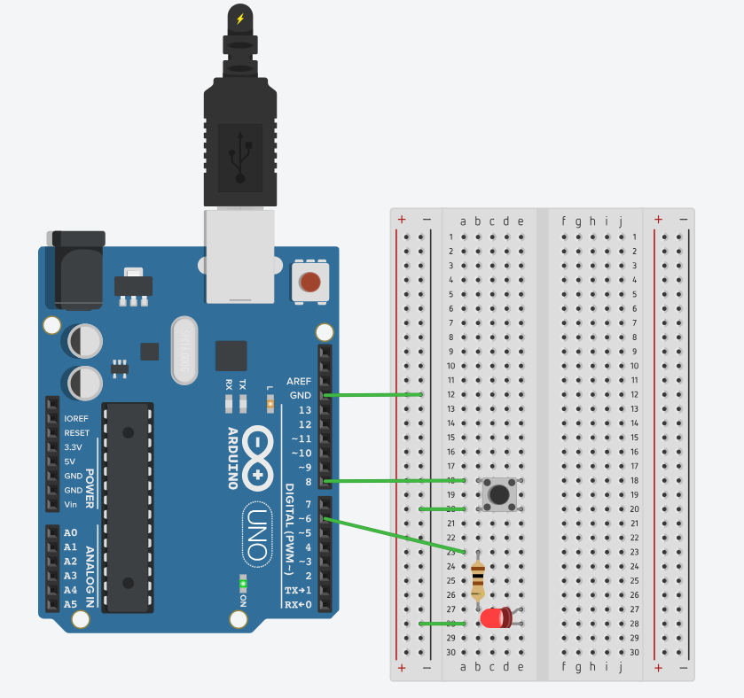
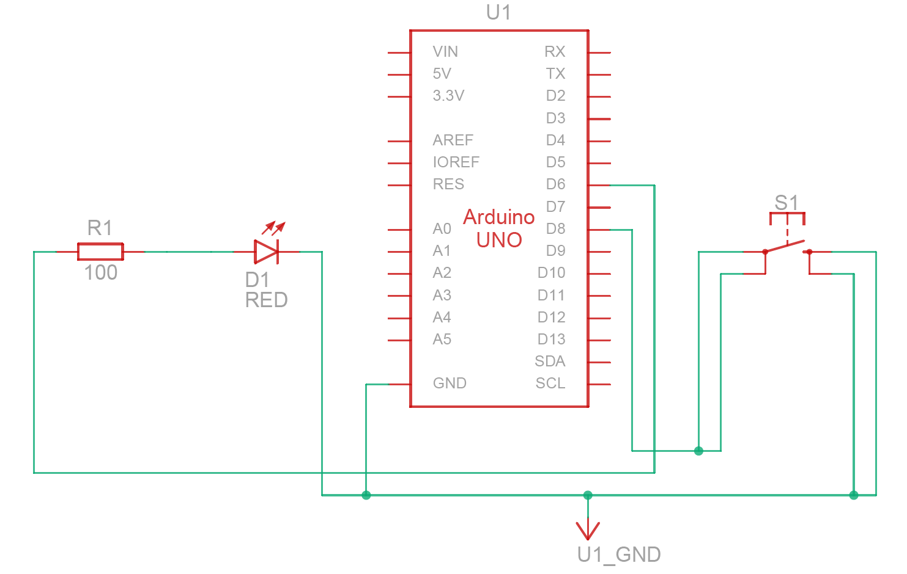
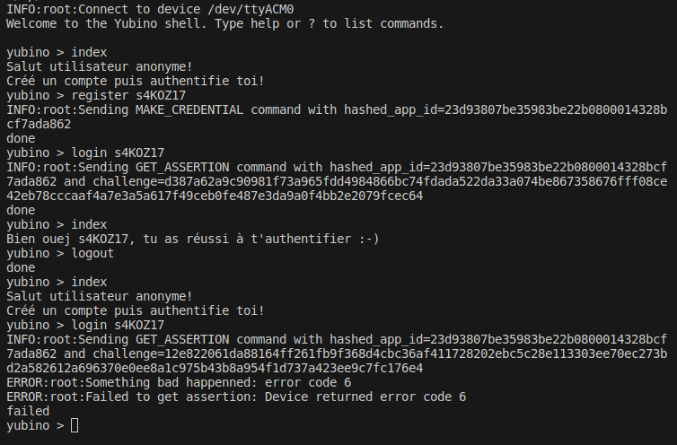
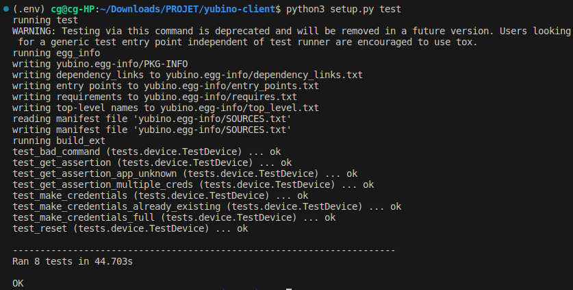

---
# PANDOC CONFIG (Markdown en PDF)
header-includes:
  - \usepackage{amsmath}
  - \usepackage{geometry}
  - \geometry{left=0.3cm,right=0.3cm,top=2cm,bottom=2cm} 
  - \usepackage{ragged2e}
---

# Projet Authenticator

## *Equipe :* `S4KOZ17`

---

## Important
> Une version PDF de ce document est disponible au cas où la prévisualisation ne serait pas accessible sur votre ordinateur : [rapport.pdf](doc/rapport.pdf)

## 1. Schéma électrique
Sur l'Arduino, nous avons connecté une LED au pin `PD6 (digital pin 6)`, et un bouton-poussoir au pin `PB0 (digital pin 8)`.

Ci-dessous, vous trouverez une représentation du circuit ainsi que le schéma électrique correspondant :

<!-- Pour Pandoc : -->
<!-- {width="45%"} {width="55%"} -->

<div style="display: flex; justify-content: space-between;">
    
    
</div>

## 2. Compilation
```bash
cd ./code/
# Compilation des programmes pour le microcontrôleur :
make # Compile le programme. Nécessite une confirmation manuelle pour l'authentification.
make test # Compile le programme pour le mode test. La confirmation pour l'authentification est automatique.
# Ces étapes sont intégrées dans le processus du makefile :
ls /dev/ | grep ttyACM0 # Étape optionnelle : vérifie si le microcontrôleur est correctement connecté et reconnu.
make clean # Étape optionnelle : nettoie
```

<!-- \newpage -->

## 3. Résultats des tests
### 3.1. Dialogue avec Relying Party
$\,$
> Le code d'erreur `6` signifie que la dernière commande n'a pas reçu le consentement de l'utilisateur.


<!-- {width="60%"} -->

### 3.2. Résultats de : `python3 setup.py test`

<!-- {width="70%"} -->

<!-- \newpage -->

## 4. Stockage des données (EEPROM)
Pour rappel, la mémoire EEPROM a une capacité de 1024 octets. Une application occupe 57 octets, répartis entre le `credential_id` (16 octets), `app_id` (20 octets) et `private_key` (21 octets). Ainsi, on peut stocker au maximum 17 applications.

À l'adresse 0, nous enregistrons le nombre d'applications `nbApps`. Par conséquent, pour ajouter une application, nous la stockons à l'adresse $(nbApps \times 57) + 1$, en suivant l'ordre `credential_id`, `app_id`, `private_key`.

## 5. Fonction RNG : `get_alea_from_Timer0`
Initialement, nous utilisions l'ADC (Analog-to-Digital Converter) pour générer des nombres aléatoires. Cependant, cette méthode s'est avérée chronophage et imposait une action supplémentaire à l'utilisateur. Pour remédier à cela, nous avons opté pour l'utilisation du `timer0` à la place.

## 6. Configuration du BAUD rate 115200
Au début, l'utilisation de la formule de calcul de l'`UBRR` (USART Baud Rate Register) entraînait des erreurs d'arrondis. Pour résoudre ce problème, nous avons consulté la documentation d'`avr-libc` (en particulier `setbaud.h`) afin d'adapter le code de l'UART.

## 7. Fonctionnalités
+ **Demande de `consentement`** : La LED clignotante connectée au pin `PD6` indique à l'utilisateur qu'un consentement est nécessaire. L'utilisateur doit appuyer sur le bouton connecté au pin `PB0` pour donner son consentement. Cette action est gérée par la fonction `get_consent`.
+ **Fonction `make_credentials`** : Cette fonction prend en entrée `app_id` et vérifie s'il existe déjà dans la mémoire non volatile.
  - **Si existant** : La fonction lit le `credential_id` associé et le retourne, avec une clé publique contenant des données aléatoires (données résiduelles du tableau).
  - **Si non existant** : La fonction demande d'abord le consentement via `get_consent`. Ensuite, elle génère les clés à l'aide de la bibliothèque `micro-ecc` et produit un `credential_id` en utilisant notre fonction RNG. Elle stocke ensuite le `credential_id`, `app_id`, la clé privée et `nbApps` incrémenté dans la mémoire EEPROM. Par la suite, le `credential_id` et la clé publique sont transmis au client Yubino.
+ **Fonction `get_assertion`** : En plus de l'`app_id`, cette fonction prend un `client_data_hash` à signer. Elle commence par vérifier si l'application est présente dans l'EEPROM en parcourant les `app_id`.
  - **Si existante** : La fonction demande le consentement, puis signe avec la clé privée récupérée de l'EEPROM. La signature et le `credential_id` sont ensuite envoyés au client Yubino.
  - **Si inexistante** : La fonction retourne l'erreur `STATUS_ERR_NOT_FOUND`.
+ **Commande `COMMAND_LIST_CREDENTIALS`** : Lors de la réception de cette commande, il n'est pas nécessaire de demander un consentement. La fonction récupère le nombre d'applications existantes dans l'EEPROM et retourne progressivement les `credential_id` et `app_id` associés. Cette commande ne rencontre jamais d'échec.
+ **Réception de la commande `COMMAND_RESET`** : Un consentement est demandé via `get_consent`. Si l'utilisateur consent, toutes les données de la mémoire non volatile sont remplacées par des zéros.


## 8. Difficultés rencontrées
Nous avons rencontré un blocage de 5 jours, causé par des comportements incohérents dus à une configuration matérielle avant l'établissement de la communication UART. Le problème principal était la configuration du registre `PRR` (Power Reduction Register) à `0xFF`. Cette valeur a pour conséquence de désactiver tous les périphériques intégrés, y compris le périphérique `PRUSART0` essentiel pour la communication UART.